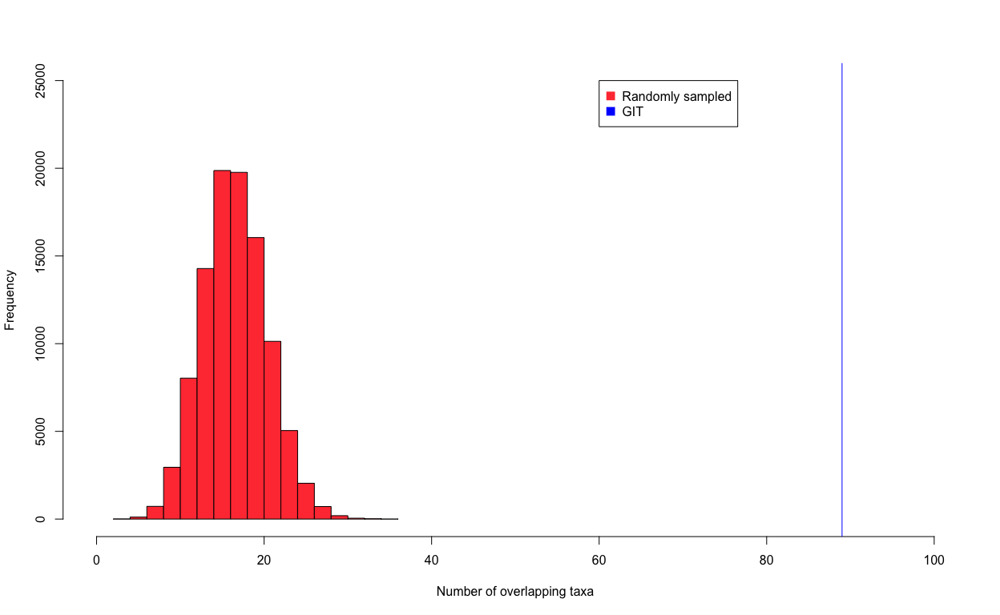
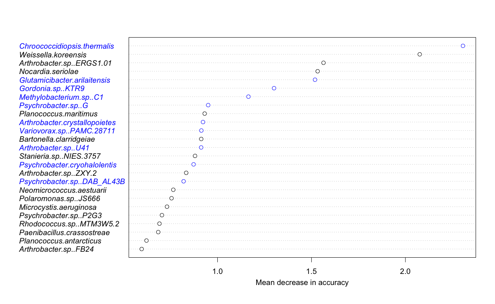
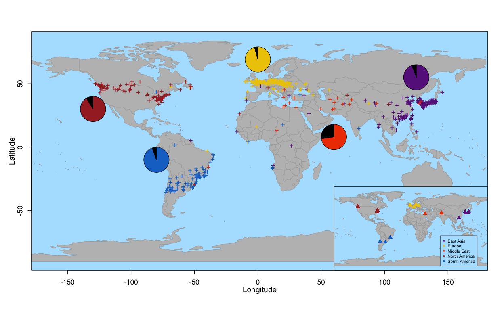

mGPS - MetaSUB 2020 microbiome results and figures
================
Leo McCarthy and Eran Elhaik

``` r
library(rworldmap)
library(caret)
library(mapplots)
library(maps)
```

``` r
replication_preds <- read.csv("Metasub/Outputs/2020/metasub_2020_results.csv")
for (i in 1:nrow(replication_preds)){
  replication_preds[i,"Distance_from_origin"] <- geosphere::distm(c(replication_preds[i,"longPred"],replication_preds[i,"latPred"]), 
                                                                 c(replication_preds[i,"longitude"],replication_preds[i,"latitude"]), 
                                                                 fun = geosphere::distHaversine)/1000
}


print(paste("Median distance from origin of predictions = ", median(replication_preds$Distance_from_origin), "Proportion of predictions within 500km =", mean(replication_preds$Distance_from_origin < 500)))
```

    ## [1] "Median distance from origin of predictions =  283.978662079766 Proportion of predictions within 500km = 0.658132530120482"

Overlapping GIT’s plot

``` r
metasub <- read.csv("Data/Metasub/msub_meta_taxa.csv")
taxa <- names(metasub[,43:ncol(metasub)])
msub_git <- as.character(read.csv(file = 'Metasub/Outputs/Global/metasub_global_git.csv')$taxa)
v <-  read.csv(file = 'Metasub/Outputs/2020/metasub_2020_git.csv')
rep_git <- as.character(v$taxa)

ints <- c()
for (i in 1:100000){
  
  ints <-  c(ints ,length(intersect(sample(taxa,250),sample(colnames(metasub[,43:ncol(metasub)]),250))))
}

#png(filename = "Metasub/Outputs/git_overlap.png",units = 'in', width = 13, height = 8,res = 300)
hist(ints,xlim = c(0,100), ylim = c(0,25000),breaks=20,xlab = "Number of overlapping taxa", col = "brown1",main = "")
abline(v=length(intersect(msub_git,rep_git)),col = "blue",cex= 1.5)
legend(x =60,y=25000,legend = c("Randomly sampled","GIT"), col = c("brown1","blue"), pt.cex = 1.5,pch = 15)
```

<!-- -->

``` r
#dev.off()
write(intersect(msub_git,rep_git), "Metasub/Outputs/2020/intersect_species.txt")
```

Git plot

``` r
top_species <- rev(v[1:25,"taxa"])

overlap <-  top_species %in% intersect(rev(top_species),msub_git)
overlap[overlap == TRUE] <- "blue"
overlap[overlap == FALSE] <- "black"
#png(filename = "Metasub/Outputs/2020/metasub_2020_git.png",units = 'in', width = 13, height = 8,res = 300)
par(font = 3)
dotchart(rev(v[1:25,"Overall"])*100,labels= top_species,cex=1.2,pt.cex = 1.3,
         xlab="Mean decrease in accuracy", mgp = c(2.2,0,0), color = overlap)
```

<!-- -->

``` r
#dev.off()
```

Global predictions plot

``` r
map <- rworldmap::getMap(resolution = "coarse")

palette <-c( "darkorchid4","gold2","orangered2","brown","dodgerblue3")

#png(filename = "Metasub/Outputs/2020/global_2020.png",units = 'in', width = 13, height = 8,res = 300)
plot(map, xlim = c(-165,168), col = "grey",border = "darkgrey", xlab = "", ylab = '', bg = "lightskyblue1")
title(ylab="Latitude",xlab = "Longitude", mgp=c(2,1,0),cex.lab=1.2)
#find coord preds by region
for ( i in 1:length(levels(replication_preds$continent))){
  this_continent <- levels(replication_preds$continent)[i]
  find_lats <- replication_preds[replication_preds[,"continent"] == this_continent,][,"latPred"]
  find_longs <- replication_preds[replication_preds[,"continent"] == this_continent,][,"longPred"]
  
  #plot predicted co-ordinates
  points(find_longs, find_lats, col = palette[i], pch = "+", cex = 1.2)
  
  #plot city prediction accuravy by continent as pies
  correctly_pred <-  mean(replication_preds[replication_preds$continent == this_continent,"cityPred"]== 
                                 replication_preds[replication_preds$continent == this_continent,"city"]) 
  incorrectly_pred <- (1 - correctly_pred) 

  
  
  
  continent_lats <- c(55,69,8,30,-10)
  continent_longs <- c(125,0,60,-130,-80)
  
  add.pie(z = c(correctly_pred, incorrectly_pred), x = continent_longs[i], y = continent_lats[i]
             ,edges=200,
             radius=10,
             col=c(palette[i],"black") , labels = ""
  )
}

#Plot city sampling locations
map.axes(cex.axis = 1.1)
par(fig = c(0.6,1,-0.0,0.5), new = T) 
plot(map,xlim = c(-165,168), col = "grey", border = "darkgrey", bg ="lightskyblue1")
for ( i in 1:length(levels(replication_preds$continent))){
  this_continent <- levels(replication_preds$continent)[i]
  find_lats <- replication_preds[replication_preds$continent == this_continent,]$latitude
  find_longs <- replication_preds[replication_preds$continent == this_continent,]$longitude
  
  points(find_longs, find_lats, col = palette[i], pch = 17, cex = 1)
}

legend(70,-20, c( "East Asia","Europe","Middle East","North America" ,"South America"), pch = 17, col = palette, cex = 0.65, bg ="lightskyblue1")
box( col = 'black')
```

<!-- -->

``` r
#dev.off()
```
