mGPS - MetaSUB global microbiome results and figures
================
Leo McCarthy and Eran Elhaik

This notebook outlines the procedure used to generate MetaSUB global
predictions for the mGPS paper, including the code used for figures.

# Data Preperation

Load dependencies

``` r
library(sp)
library(rworldmap)
library(caret)
library(maps)
library(geosphere)
library(caret)
library(plyr)
library(rgeos)
library(mapplots)
```

# Geographically Informative Taxa

Fig S9, effect of removing redundsnt taxa.

``` r
git_subset <- read.csv("Metasub/Outputs/Global/metasub_git_subsets.csv")
plot(git_subset[,"n_vars"], git_subset[,"accuracy"], type = "b", xlab = "", ylab = "", cex = 1.5, col = "dodgerblue")
title(ylab="Accuracy of random forest classifier",xlab = "Number of taxa", mgp=c(2.5,1.5,1),cex.lab=1)
points(git_subset[3,"n_vars"],git_subset[3,"accuracy"], pch = 20, cex = 1.2,col = "dodgerblue")
```

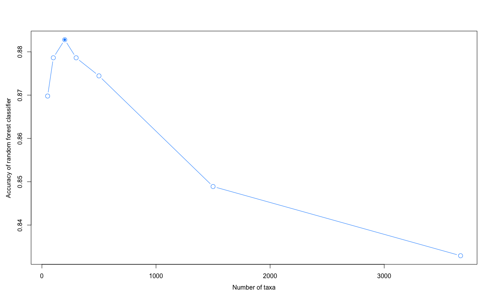<!-- -->

Looking at the results it’s clear using all the variables is not
optimal. 200 variables is the optimum subset from these results so we
will use this as our optimum subset of bacterial species for further
analysis when aiming to predict city of origin.

Top 25 geographic indicator species

``` r
#Extract and rank species importance
v <- read.csv("Metasub/Outputs/Global/metasub_global_git.csv")
top_species <- v[1:25,"taxa"]

#plot
par(font = 3)
dotchart(rev(v[1:25,"Overall"])*100,labels= rev(top_species),cex=1.2,pt.cex = 1.3,
         xlab="Mean decrease in accuracy", mgp = c(2.2,0,0))
```

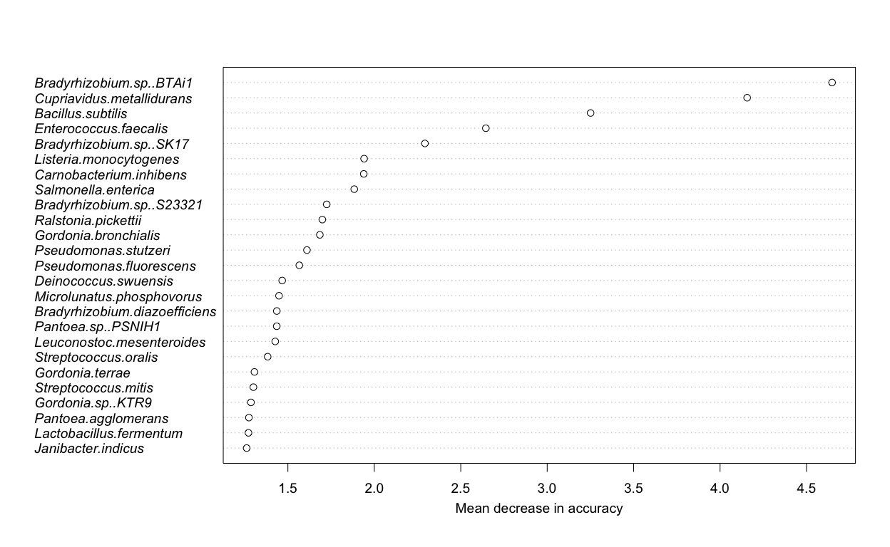<!-- -->

Fig S11, Geographic distribution of dbundance for top 25 geo indicator
species. Plots will be saved to Outputs/Metasub/Gloabl

    ## Regions defined for each Polygons
    ## Regions defined for each Polygons
    ## Regions defined for each Polygons
    ## Regions defined for each Polygons
    ## Regions defined for each Polygons
    ## Regions defined for each Polygons
    ## Regions defined for each Polygons
    ## Regions defined for each Polygons
    ## Regions defined for each Polygons
    ## Regions defined for each Polygons
    ## Regions defined for each Polygons
    ## Regions defined for each Polygons
    ## Regions defined for each Polygons
    ## Regions defined for each Polygons
    ## Regions defined for each Polygons
    ## Regions defined for each Polygons
    ## Regions defined for each Polygons
    ## Regions defined for each Polygons
    ## Regions defined for each Polygons
    ## Regions defined for each Polygons
    ## Regions defined for each Polygons
    ## Regions defined for each Polygons
    ## Regions defined for each Polygons
    ## Regions defined for each Polygons
    ## Regions defined for each Polygons

# Prediction results

Get Prediction
results

``` r
na_levels <- setdiff(levels(MetasubDataPreds$city),levels(MetasubDataPreds$cityPred))
levels(MetasubDataPreds$cityPred ) <- c(levels(MetasubDataPreds$cityPred) , na_levels)

res <- confusionMatrix(MetasubDataPreds$cityPred, MetasubDataPreds$city)[[4]]
```

    ## Warning in confusionMatrix.default(MetasubDataPreds$cityPred,
    ## MetasubDataPreds$city): Levels are not in the same order for reference and data.
    ## Refactoring data to match.

``` r
res <- round(res, 2)

#Print test results 
print(c(mean(MetasubDataPreds$cityPred ==MetasubDataPreds$city)
   ,RMSE(MetasubDataPreds$latPred, MetasubDataPreds$latitude),
       RMSE(MetasubDataPreds$longPred, MetasubDataPreds$longitude)))
```

    ## [1]  0.9199017  8.0305313 22.3982501

Fimd correlation with city
population

``` r
CityPop <- read.csv(file = "Data/Geo/CityPopulations.csv", header = TRUE)

city_names <- c("Auckland" ,"Baltimore" ,"Barcelona", "Berlin","Bogota", 
                "Brisbane","Denver","Doha" ,"Fairbanks","Hamilton",
                "Hanoi","Hong Kong","Ilorin","Kuala Lumpur","Kyiv",
                "Lisbon", "London" ,"Marseille" , "Minneapolis", "Naples"  ,"New York City",
                "Offa" ,"Oslo" ,"Paris","Porto","Rio de Janeiro",
                "Sacramento","San Francisco" ,"Santiago" , "Sao Paulo" ,"Sendai",
                "Seoul","Singapore", "Sofia","Stockholm","Taipei",
                "Tokyo","Vienna","Yamaguchi","Zurich")
city_pop <- data.frame()
for (i in 1:length(levels(MetasubDataPreds$city))){ 
  this_city <- levels(MetasubDataPreds$city)[i]
  city_pop[i,"city_size"] <-  CityPop[i,"population"]
  city_pop[i,"balanced_acc"] <-  res[ paste("Class:", this_city),"Balanced Accuracy"]
  city_pop[i,"within_500"] <-  mean(MetasubDataPreds[MetasubDataPreds$city == this_city, "Distance_from_origin"] < 500)
}
```

Fig S3 correlation with city population

``` r
options(scipen = 5)
plot(city_pop$city_size,100*city_pop[,"within_500"], xlab ="City population",
     ylab = "Predictions within 500km (%)", pch = 16, cex = 0.7)
text(city_pop$city_size ,100*city_pop[,"within_500"] + 1 ,labels = city_names, cex = 0.6)
```

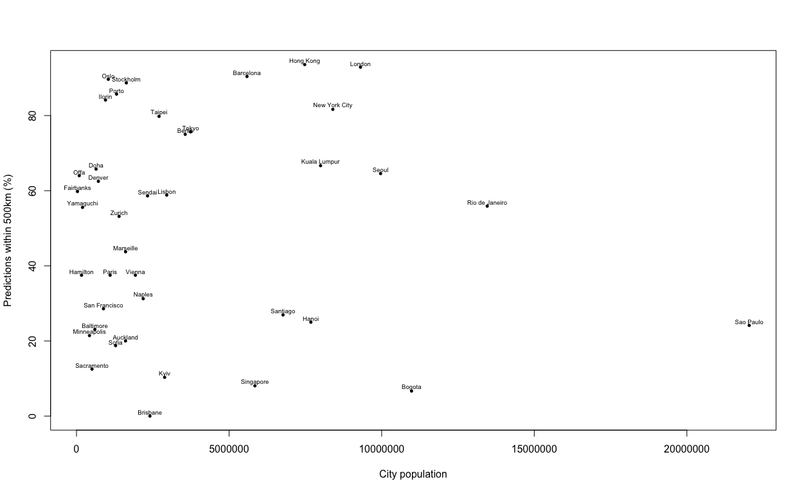<!-- -->

Next use predicted co-ordinates to a generate the distance of
predictions from the true origin using the haversine
formula.

``` r
#Using lat long predictions determine distance (km) of the prediction from true origin using haversine distance. 

for (i in 1:nrow(MetasubDataPreds)){
  MetasubDataPreds[i,"Distance_from_origin"] <- geosphere::distm(c(MetasubDataPreds[i,"longPred"],MetasubDataPreds[i,"latPred"]), c(MetasubDataPreds[i,"longitude"],MetasubDataPreds[i,"latitude"]), fun = geosphere::distHaversine)/1000
}


#Print distance from origin results 
print(c(mean(MetasubDataPreds$Distance_from_origin ),
median(MetasubDataPreds$Distance_from_origin ),
mean(MetasubDataPreds$Distance_from_origin < 250)))
```

    ## [1] 790.0138799 136.6852889   0.6228501

Fig 1, plot the predicted origin of each global sample. Coloured by
continent of origin. City classification prediction accuracy is showm by
the pie charts.

``` r
#####world map showing by continent
map <- rworldmap::getMap(resolution = "coarse")

palette <-c( "darkorchid4","gold2","dodgerblue3","brown","orangered2","mediumspringgreen","deeppink2")


plot(map, xlim = c(-165,168), col = "grey",border = "darkgrey", xlab = "", ylab = '', bg = "lightskyblue1")
title(ylab="Latitude",xlab = "Longitude", mgp=c(2,1,0),cex.lab=1.2)
#find coord preds by region
for ( i in 1:length(levels(MetasubDataPreds$continent))){
  this_continent <- levels(MetasubDataPreds$continent)[i]
  find_lats <- MetasubDataPreds[MetasubDataPreds[,"continent"] == this_continent,][,"latPred"]
  find_longs <- MetasubDataPreds[MetasubDataPreds[,"continent"] == this_continent,][,"longPred"]
  
  #plot predicted co-ordinates
  points(find_longs, find_lats, col = palette[i], pch = "+", cex = 1.2)
  
  #plot city prediction accuravy by continent as pies
  correctly_pred <-  mean(MetasubDataPreds[MetasubDataPreds$continent == this_continent,"cityPred"]== 
                                 MetasubDataPreds[MetasubDataPreds$continent == this_continent,"city"]) 
  incorrectly_pred <- (1 - correctly_pred) 

  
  
  
  continent_lats <- c(55,69,8,40,-40,-10,-5)
  continent_longs <- c(125,0,60,-130,140,-80,5)
  
  add.pie(z = c(correctly_pred, incorrectly_pred), x = continent_longs[i], y = continent_lats[i]
             ,edges=200,
             radius=10,
             col=c(palette[i],"black") , labels = ""
  )
}

#Plot city sampling locations
map.axes(cex.axis = 1.1)
par(fig = c(0,0.4,0.0,0.5), new = T) 
plot(map,xlim = c(-165,168), col = "grey", border = "darkgrey", bg ="lightskyblue1")
for ( i in 1:length(levels(MetasubDataPreds$continent))){
  this_continent <- levels(MetasubDataPreds$continent)[i]
  find_lats <- MetasubDataPreds[MetasubDataPreds$continent == this_continent,]$city_latitude
  find_longs <- MetasubDataPreds[MetasubDataPreds$continent == this_continent,]$city_longitude
  
  points(find_longs, find_lats, col = palette[i], pch = 17, cex = 1)
}

legend(-165,-15, c("East Asia","Eurpoe","Middle East",
                 "North America",
                 "Oceania",
                 "South America",
                 "Sub Saharan Afica"), pch = 17, col = palette, cex = 0.5, bg ="lightskyblue1")
box( col = 'black')
```

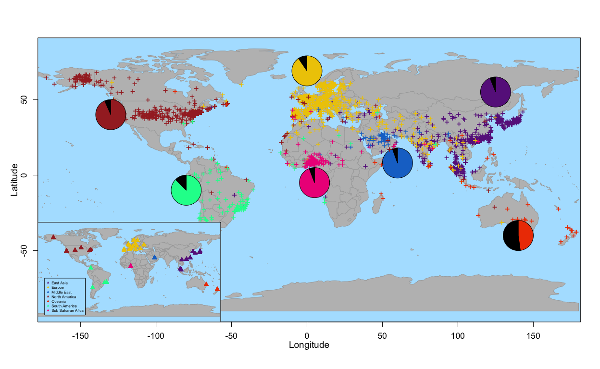<!-- -->

``` r
map <- getMap(resolution = "low")
palette <-c( "gold2","brown","dodgerblue3","darkorchid4","orangered2","olivedrab2","deeppink2","mediumspringgreen", "gray21","royalblue","yellow1","orange","purple1","cyan2")
```

Fig 1
Europe

``` r
europe <- droplevels(MetasubDataPreds[MetasubDataPreds$continent == "europe",])

plot(map,xlim = c(-30,50), ylim = c(30,60), col = "grey", border = "grey40", axes =F, bg = "lightskyblue1")
for (i in 1:length(levels(europe$city))){
  this_city <- levels(europe$city)[i]
  find_lats <- europe[europe[,"city"] == this_city,]$latPred
  find_longs <- europe[europe[,"city"] == this_city,]$longPred
  
  points(find_longs, find_lats, col = palette[i], pch = "+", cex = 1.5)
  
}

for (i in 1:length(levels(europe$city))){
  this_city <- levels(europe$city)[i]
  
  city_centre.lat <- europe[europe[,"city"] == this_city,]$city_latitude
  city_centre.long <- europe[europe[,"city"] == this_city,]$city_longitude
  
  points(city_centre.long, city_centre.lat, col = "black", bg =palette[i] ,pch = 24, cex = 1.5)
}

legend(42,60, legend = c("Barcelona","Berlin", "Kyiv", "Lisbon", "London","Marseille",
                          "Naples", "Oslo", "Paris", "Porto", "Sofia", "Stockholm", "Vienna", "Zurich"), col = c(palette),pch = 17, box.lty = 1, cex = 1.1, bg = "lightskyblue1")

#map.axes(cex.axis = 0.8)
map.scale(x=-28, cex = 1)
```

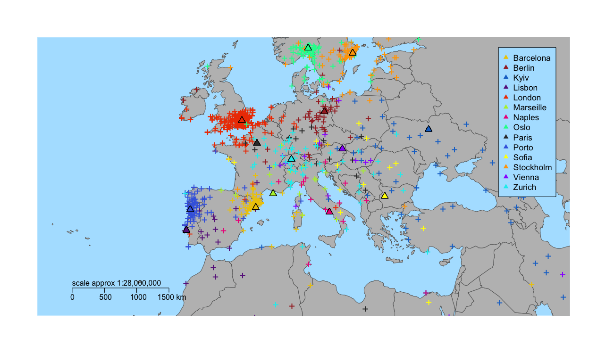<!-- -->

Fig 1 North
America

``` r
palette <-c( "gold2","darkorchid4","dodgerblue3","mediumspringgreen","orangered2","olivedrab2","deeppink2")
north_america <- droplevels(MetasubDataPreds[MetasubDataPreds$continent == "north_america",])

plot(map,xlim = c(-150,0), ylim = c(10,70), col = "grey", border = "grey40", axes =F, bg = "lightskyblue1")
for (i in 1:length(levels(north_america$city))){
  this_city <- levels(north_america$city)[i]
  find_lats <- north_america[north_america[,"city"] == this_city,]$latPred
  find_longs <- north_america[north_america[,"city"] == this_city,]$longPred

  points(find_longs, find_lats, col = palette[i], pch = "+", cex = 1.5)
 
}

for (i in 1:length(levels(north_america$city))){
  this_city <- levels(north_america$city)[i]
 
  city_centre.lat <- north_america[north_america[,"city"] == this_city,]$city_latitude
  city_centre.long <- north_america[north_america[,"city"] == this_city,]$city_longitude
  
  points(city_centre.long, city_centre.lat, col = "black", bg =palette[i] ,pch = 24, cex = 1.5)
}

legend(-27,70, legend = c("Baltimore","Denver","Fairbanks",
                          "Minneapolis","New York City", "Sacramento","San Francisco"), col = c(palette),pch = 17, box.lty = 1, cex = 1.1, bg = "lightskyblue1")

#map.axes(cex.axis = 0.8)
map.scale(x=-54, cex = 1)
```

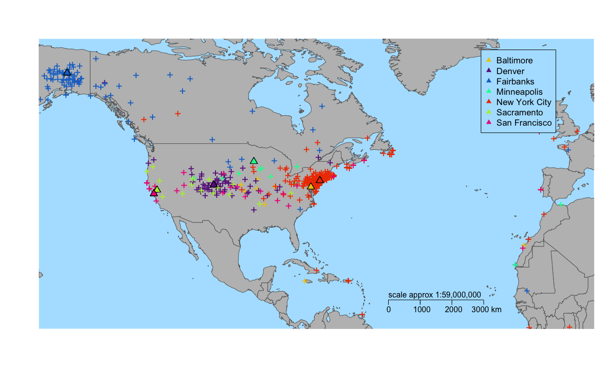<!-- -->

Fig 1 South America

``` r
palette <-c( "gold2","darkorchid4","dodgerblue3","deeppink2")
south_america <- droplevels(MetasubDataPreds[MetasubDataPreds$continent == "south_america",])


plot(map,xlim = c(-90,5), ylim = c(-55,30),col = "grey", border = "grey40", axes =F, bg = "lightskyblue1")
for (i in 1:length(levels(south_america$city))){
  this_city <- levels(south_america$city)[i]
  find_lats <- south_america[south_america[,"city"] == this_city,]$latPred
  find_longs <- south_america[south_america[,"city"] == this_city,]$longPred
  
  points(find_longs, find_lats, col = palette[i], pch = "+", cex = 1.5)
  
}
for (i in 1:length(levels(south_america$city))){
  this_city <- levels(south_america$city)[i]
  
  city_centre.lat <- south_america[south_america[,"city"] == this_city,]$city_latitude
  city_centre.long <- south_america[south_america[,"city"] == this_city,]$city_longitude
  
  points(city_centre.long, city_centre.lat, col = "black", bg =palette[i] ,pch = 24, cex = 1.5)
}
legend(20,20, legend = c("Bogota","Rio de Janeiro","Santiago","Sao Paulo"), col = c(palette),pch = 17, box.lty = 1, cex = 1.1, bg = "lightskyblue1")

#map.axes(cex.axis = 0.8)
map.scale(-110,cex = 1)
```

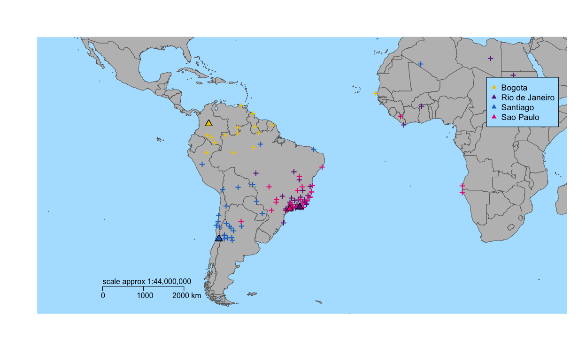<!-- -->

Fig 1 south east
asia

``` r
east_asia <- droplevels(MetasubDataPreds[MetasubDataPreds$continent == "east_asia",])
palette <-c( "gold2","darkorchid4","dodgerblue3","purple1","orangered2","olivedrab2","deeppink2","mediumspringgreen", "gray21")


plot(map,xlim = c(95,100), ylim = c(-15,50), col = "grey", border = "grey40", axes =F, bg = "lightskyblue1")
for (i in 1:length(levels(east_asia$city))){
  this_city <- levels(east_asia$city)[i]
  find_lats <- east_asia[east_asia[,"city"] == this_city,]$latPred
  find_longs <- east_asia[east_asia[,"city"] == this_city,]$longPred
  
  points(find_longs, find_lats, col = palette[i], pch = "+", cex = 1.5)
  #points(city_centre.long, city_centre.lat, col = "black", bg =palette[i] ,pch = 24, cex = 1.5)
}
for (i in 1:length(levels(east_asia$city))){
  this_city <- levels(east_asia$city)[i]

  city_centre.lat <- east_asia[east_asia[,"city"] == this_city,]$city_latitude
  city_centre.long <- east_asia[east_asia[,"city"] == this_city,]$city_longitude
  
  points(city_centre.long, city_centre.lat, col = "black", bg =palette[i] ,pch = 24, cex = 1.5)
}

legend(145,50, legend = c("Hanoi","Hong Kong",
                          "Kuala Lumpur","Sendai","Seoul",
                          "Singapore","Taipei","Tokyo",
                          "Yamaguchi"),  col = c(palette),pch = 17, box.lty = 1, cex = 1.1, bg = "lightskyblue1")
#map.axes(cex.axis = 0.8)
map.scale(60,cex = 1)
```

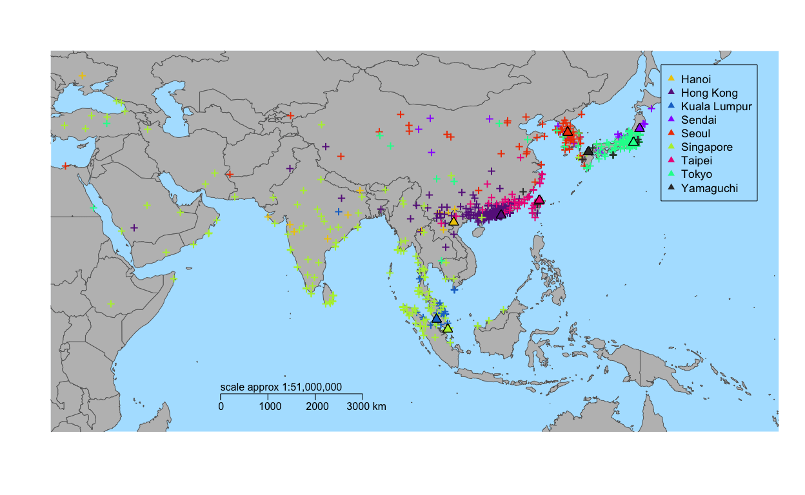<!-- -->

Fig 1 Africa and middle east

``` r
palette <-c( "deeppink2","darkorchid4","gold2")
sub_saharan_africa <- droplevels(MetasubDataPreds[MetasubDataPreds$continent %in%  c('sub_saharan_africa','middle_east'),] )


plot(map,xlim = c(10,45), ylim = c(-35,40), col = "grey", border = "grey40", bg = "lightskyblue1")
for (i in 1:length(levels(sub_saharan_africa$city))){
  this_city <- levels(sub_saharan_africa$city)[i]
  find_lats <- sub_saharan_africa[sub_saharan_africa[,"city"] == this_city,]$latPred
  find_longs <- sub_saharan_africa[sub_saharan_africa[,"city"] == this_city,]$longPred
 
  points(find_longs, find_lats, col = palette[i], pch = "+", cex = 1.5)
  
}
for (i in 1:length(levels(sub_saharan_africa$city))){
  this_city <- levels(sub_saharan_africa$city)[i]
  
  city_centre.lat <- sub_saharan_africa[sub_saharan_africa[,"city"] == this_city,]$city_latitude
  city_centre.long <- sub_saharan_africa[sub_saharan_africa[,"city"] == this_city,]$city_longitude
 
  points(city_centre.long, city_centre.lat, col = "black", bg =palette[i] ,pch = 24, cex = 1.5)
}
legend(80,40, legend = c("Doha","Ilorin", "Offa"), col = c(palette),pch = 17, box.lty = 1, cex = 1.1, bg = "lightskyblue1")

#map.axes(cex.axis = 0.8)
map.scale(cex = 1)
```

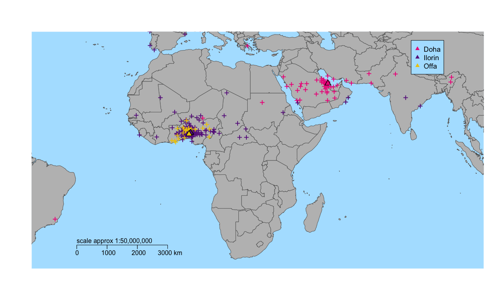<!-- -->

Fig 1 Oceania

``` r
palette <-c( "deeppink2","darkorchid4","gold2")
oceania <- droplevels(MetasubDataPreds[MetasubDataPreds$continent == "oceania",])


plot(map,xlim = c(80,170), ylim = c(-50,30), col = "grey", border = "grey40", bg = "lightskyblue1")
for (i in 1:length(levels(oceania$city))){
  this_city <- levels(oceania $city)[i]
  find_lats <- oceania[oceania [,"city"] == this_city,]$latPred
  find_longs <- oceania[oceania [,"city"] == this_city,]$longPred
  city_centre.lat <- oceania[oceania [,"city"] == this_city,]$city_latitude
  city_centre.long <- oceania[oceania [,"city"] == this_city,]$city_longitude
  points(find_longs, find_lats, col = palette[i], pch = "+", cex = 1.5)
  points(city_centre.long, city_centre.lat, col = "black", bg =palette[i] ,pch = 24, cex = 1.5)
}
legend(175,20, legend = c("Auckland", "Brisbane", "Hamilton"), col = c(palette),pch = 17, box.lty = 1, cex = 1.1, bg = "lightskyblue1")

#map.axes(cex.axis = 0.8)
map.scale(cex = 1)
```

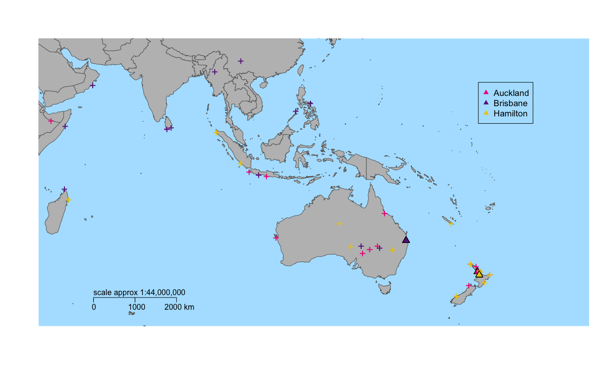<!-- -->

Calculate distance from origin for Fig
S1

``` r
city_names <- c("Auckland" ,"Baltimore" ,"Barcelona", "Berlin","Bogota", 
                "Brisbane","Denver","Doha" ,"Fairbanks","Hamilton",
                "Hanoi","Hong Kong","Ilorin","Kuala Lumpur","Kyiv",
                "Lisbon", "London" ,"Marseille" , "Minneapolis", "Naples"  ,"New York City",
                "Offa" ,"Oslo" ,"Paris","Porto","Rio de Janeiro",
                "Sacramento","San Francisco" ,"Santiago" , "Sao Paulo" ,"Sendai",
                "Seoul","Singapore", "Sofia","Stockholm","Taipei",
                "Tokyo","Vienna","Yamaguchi","Zurich")


bar_df1 <- data.frame(row.names = c(city_names, "Overall"))


for (i in 1: length(levels(MetasubDataPreds$city))){
  this_city <- levels(MetasubDataPreds$city)[i]
  prop <- mean(MetasubDataPreds[MetasubDataPreds$city == this_city,][,"Distance_from_origin"] < 100)
  bar_df1[i+1,"0 - 100km"] <- prop
  
  overall_prop <- mean(MetasubDataPreds[,"Distance_from_origin"] < 100)
  bar_df1[ 1,"0 - 100km"] <- overall_prop
}


for (i in 1: length(levels(MetasubDataPreds$city))){
  this_city <- levels(MetasubDataPreds$city)[i]
  prop <- mean(MetasubDataPreds[MetasubDataPreds$city == this_city,][,"Distance_from_origin"] > 100 & MetasubDataPreds[MetasubDataPreds$city == this_city,][,"Distance_from_origin"] < 500)
  bar_df1[i+1,"100 - 500km"] <- prop
  
  overall_prop <-mean(MetasubDataPreds[,"Distance_from_origin"] > 100 & MetasubDataPreds[,"Distance_from_origin"] < 500)
  bar_df1[ 1,"100 - 500km"] <- overall_prop
}

for (i in 1: length(levels(MetasubDataPreds$city))){
  this_city <- levels(MetasubDataPreds$city)[i]
  prop <- mean(MetasubDataPreds[MetasubDataPreds$city == this_city,][,"Distance_from_origin"] > 500 & MetasubDataPreds[MetasubDataPreds$city == this_city,][,"Distance_from_origin"] < 1000)
  bar_df1[i+1,"500 - 1000km"] <- prop
  
  overall_prop <- mean(MetasubDataPreds[,"Distance_from_origin"] > 500 & MetasubDataPreds[,"Distance_from_origin"] < 1000)
  bar_df1[ 1,"500 - 1000km"] <- overall_prop
}

for (i in 1: length(levels(MetasubDataPreds$city))){
  this_city <- levels(MetasubDataPreds$city)[i]
  prop <- mean(MetasubDataPreds[MetasubDataPreds$city == this_city,][,"Distance_from_origin"] > 1000 & MetasubDataPreds[MetasubDataPreds$city == this_city,][,"Distance_from_origin"] < 2000)
  bar_df1[i+1,"1000 - 2000km"] <- prop
  
  overall_prop <- mean(MetasubDataPreds[,"Distance_from_origin"] > 1000 & MetasubDataPreds[,"Distance_from_origin"] < 2000)
  bar_df1[ 1,"1000 - 2000km"] <- overall_prop
}
for (i in 1: length(levels(MetasubDataPreds$city))){
  this_city <- levels(MetasubDataPreds$city)[i]
  prop <- mean(MetasubDataPreds[MetasubDataPreds$city == this_city,][,"Distance_from_origin"] > 2000 & MetasubDataPreds[MetasubDataPreds$city == this_city,][,"Distance_from_origin"] < 3000)
  bar_df1[i+1,"2000 - 3000km"] <- prop
  
  overall_prop <- mean(MetasubDataPreds[,"Distance_from_origin"] > 2000 & MetasubDataPreds[,"Distance_from_origin"] < 3000)
  bar_df1[1,"2000 - 3000km"] <- overall_prop
}
for (i in 1: length(levels(MetasubDataPreds$city))){
  this_city <- levels(MetasubDataPreds$city)[i]
  prop <- mean(MetasubDataPreds[MetasubDataPreds$city == this_city,][,"Distance_from_origin"] > 3000 )
  bar_df1[i+1,"> 3000km"] <- prop
  
  overall_prop <- mean(MetasubDataPreds[,"Distance_from_origin"] > 3000)
  bar_df1[ 1,"> 3000km"] <- overall_prop
}
size <- c()
for (i in 1: length(levels(MetasubDataPreds$city))){
  
  this_city <- levels(MetasubDataPreds$city)[i]
  size[i] <- length(which(MetasubDataPreds$city == this_city))
}
```

Fig S1 dist from origin barplot

``` r
par(xpd = T, mar = par()$mar + c(1,0,0,7), mgp = c(0,0.7,0), las=2)
bp <- barplot(t(bar_df1*100), space = 0,col=c("lightyellow","slategray1","lightblue", "skyblue", "royalblue3", "darkblue"), 
              names.arg=c("Overall",paste0(city_names,"  (",size,")"), axes = FALSE) , 
              las =2, cex.names=.6, ylab = "", axisnames = F, axes = F)
axis(side =2, pos = 0)
mtext(text = c("Overall",paste0(city_names," (",size,")")), side = 1, at = bp, line = 0, padj = 1, cex = 0.7)
title(ylab="Proportion of sample predictions %", mgp=c(0,0,0),cex.lab=1)

legend("topright",inset = c(-0.1,0.4), rev(c(colnames(bar_df1))), 
       fill = rev(c("lightyellow","slategray1","lightblue", "skyblue", "royalblue3", "darkblue")) ,
       bty = 1, cex = 0.8)
```

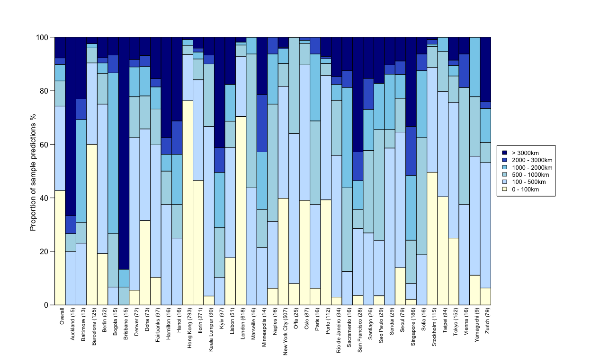<!-- -->

``` r
par(mar=c(5, 4, 4, 2) + 0.1)
```

Fig S3, effect of sample size on city accurcay

``` r
#calculate
city_sample_sizes <- data.frame()
for (i in 1:length(levels(MetasubDataPreds$city))){ 
  this_city <- levels(MetasubDataPreds$city)[i]
  city_sample_sizes[i,"city_size"] <-  summary(MetasubDataPreds$city)[this_city]
  city_sample_sizes[i,"within_500"] <-  mean(MetasubDataPreds[MetasubDataPreds$city == this_city,]$Distance_from_origin < 500)
}

#plot
plot(city_sample_sizes$city_size,100*city_sample_sizes[,"within_500"], xlab ="",
     ylab = "", pch = 16, cex = 0.7)
text(city_sample_sizes$city_size ,100*city_sample_sizes[,"within_500"] + 3 ,labels =city_names, cex = 0.6)
lines(lowess(city_sample_sizes$city_size,100*city_sample_sizes[,"within_500"]), col="red")
title(ylab="Predictions within 500km (%)",xlab = "Number of samples from city", mgp=c(2,1,0),cex.lab=1.2)
```

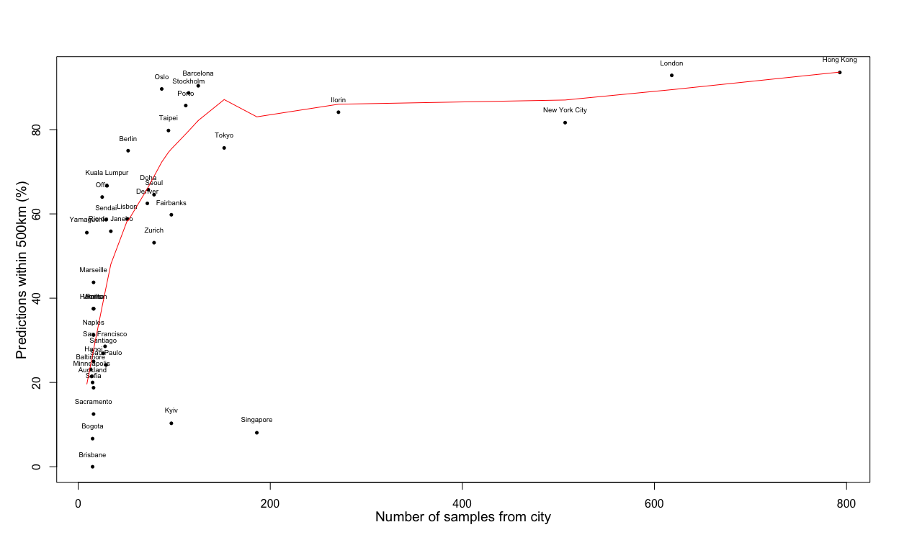<!-- -->
