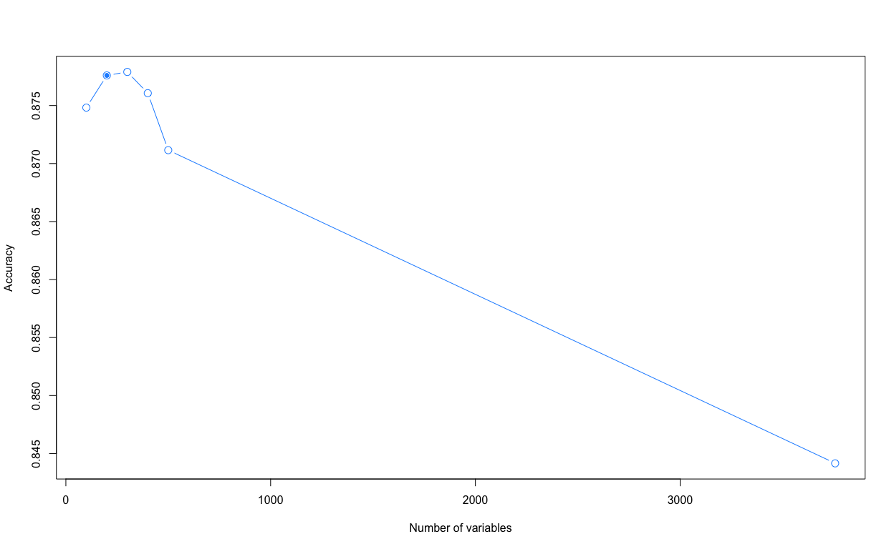
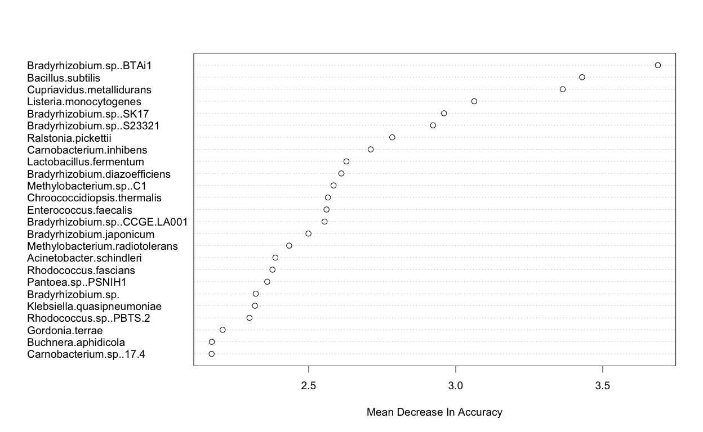
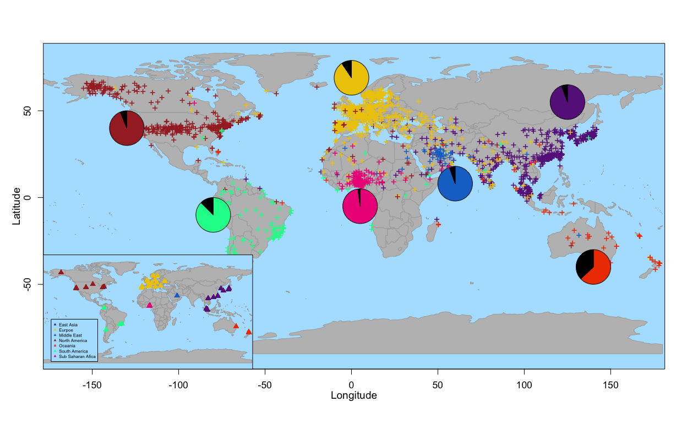

Mapping with microbes, machine learning and XBoost predicts location
================

This is a comprehensive outline of the main modeling methods used in our
mGPS paper in order to assist in reproducibility of results.

# Data Preperation

Load useful packages

``` r
library(sp)
library(rworldmap)
library(caret)
library(maps)
library(MASS)
library(randomForest)
library(geosphere)
library(doParallel)
library(caret)
library(plyr)
library(maptools)
library(rgeos)
library(mapplots)
```

First we import the metasub datasets for metadata (city, latitude,
longitude etc) and bacterial abundance data. Merge these sets by sample
ID.

Control samples are be removed for obvious reasons.

``` r
#Import data sets 
complete_meta <- read.csv(file = "complete_metadata.csv", header = TRUE)
bac_data <- read.csv(file= "refseq.krakenhll_species.csv", header = TRUE)

#Change NA's to 0 in bacterial abundance data 
bac_data[is.na(bac_data)] <- 0 

#merge bacterial and meta data
metasub_data <- merge(complete_meta,bac_data,by.x="uuid",by.y="uuid")

#Remove control samples
control_samples <- c( which(metasub_data$city %in% c("control", "other_control","neg_control","other","pos_control")), which(metasub_data$control_type %in% c("ctrl cities","negative_control","positive_control"))) 
metasub_data <- droplevels(metasub_data[-c(control_samples), ])
```

We will also remove some samples for which the origin isn’t clear
e.g. the name of the origin does match the co-ordinates. Samples from
bouroughs within london will be re-labelled simply as London for
consistency.

There are a group of samples from small towns accross uk, we will remove
these as there are very few from each town and they will clutter up
results A LOT while ading little improvement to a model on a global
scale

``` r
#remove sparse samples locations and dubiously labelled samples. 
remove_samples <- which(metasub_data$city %in% c("tsuruoka", "antarctica","lands_end", "birmingham", "belfast", "bradford", "bristol","bury","cairngorm", "edinborough", "jaywick", "newcastle","swansea","eastbourne", "st_louis", "eden"))
metasub_data <- metasub_data[-c(remove_samples), ]

#re-label london boroughs 
metasub_data$city[metasub_data$city %in% c("kensington","islington")] <- "london" 
metasub_data <- droplevels(metasub_data)
```

``` r
#Correction of identified misslabelling of data 
metasub_data$latitude[metasub_data$city == "kyiv"] <- metasub_data$city_latitude[metasub_data$city == "kyiv"]
metasub_data$longitude[metasub_data$city == "kyiv"] <- metasub_data$city_longitude[metasub_data$city == "kyiv"]
metasub_data$continent[metasub_data$city == "porto"] <- "europe"
```

Not all of the samples have exact origin co-ordinates recorded, for the
purposes of global predictions we can substitute the central
co-ordinates of the city of origin for the missing exact co-ordiantes,
found in the city meta-data. On the global scale this shouldn’t be too
much of an issue.

``` r
#impute unknown exact co-ords for city co-ords
metasub_data[is.na(metasub_data$latitude),]$latitude <- metasub_data[is.na(metasub_data$latitude),]$city_latitude
metasub_data[is.na(metasub_data$longitude),]$longitude <- metasub_data[is.na(metasub_data$longitude),]$city_longitude

#correction to some incorrect city co-ords for a few london samples
metasub_data[metasub_data$city == "london",]$city_latitude <- 51.50853
metasub_data[metasub_data$city == "london",]$city_longitude <- -0.12574
```

# Feature selection

This dataset contains rather a large amount of predictor variables, many
of which will be random noise and detrimental to both model accuracy and
computation time.

To select an optimum set of variables for each of the target variables
of interest (city,latitude and longitude) we will use recursive feature
elimination with random forests. The caret function “rfe” uses
re-sampling and external validation to protect against selecting
features that lead us to overfit the training data. More information is
avalable at
<https://topepo.github.io/caret/recursive-feature-elimination.html>

``` r
set.seed(123)

#Activate parallel processing 
registerDoParallel(parallel::detectCores() - 1)

#recursive feature elimination for the target variable "city"
rfe_ctrl <- rfeControl(functions = rfFuncs,
                   method = "cv",
                   number =  5,
                   verbose = FALSE,
                   allowParallel = TRUE
                   )
featureElimination <- rfe(x = metasub_data[, c(43:3799)],y = metasub_data$city,
                 sizes = c(100,200,300,400,500,1500),
                 rfeControl = rfe_ctrl,
                 tuneLength = 0
                 )

optimumVarsCity <- featureElimination$optVariables[1:200]
```

Here we can see the effect of selecting smaller subsets of features on
preict city of
origin.

``` r
plot(featureElimination$results$Variables, featureElimination$results$Accuracy, type = "b", xlab = "Number of variables", ylab = "Accuracy", cex = 1.4, col = "dodgerblue")
points(featureElimination$results$Variables[2],featureElimination$results$Accuracy[2], pch = 20, cex = 1.2,col = "dodgerblue")
```

<!-- -->

Looking at the results it’s clear using all the variables is not
optimal. 300 variables is the optimum subset from these results, however
the accuracy loss by using only 200 variables is minisuclue (\<0.001%)
and using only 200 variables would speed up compuation so we will use
this as our optimum subset of bacterial species for further analysis
when aiming to predict city of origin.

We can take a look at the most 20 important variables, visually.

``` r
imp <- varImp(featureElimination)
dotchart(rev(imp[1:25, "Overall"]),labels= rev(row.names(imp)[1:25]),cex=1.2,pt.cex = 1.3,
         xlab="Mean Decrease In Accuracy")
```

<!-- -->

# Modeling

Our model makes use of regressor chains (more info:
<http://cig.fi.upm.es/articles/2015/Borchani-2015-WDMKD.pdf>) in order
to preoduce multi output predictions for class (city), latittude and
longitude. This techniques involves chaining predictions for a series of
outputs as input features for the next level model. In this case 3
chained XGboost models are used with hyperparameter tuning carried out
by 5-fold cross validation of the trainng set using grid search methods.

Here this function here takes 4 arguments: a training set, a test set, a
target class variable, a set of variables to use when training the
model. The function outputs the class,latitude and longitude predictions
from applying this model to the input test set.

``` r
MappingModel <-  function(training,testing,classTarget,variables){
  
  set.seed(1234)
  folds <- createFolds(training[,classTarget], k = 5, returnTrain = T)
  
  
  
  trControlClass <-  trainControl(
    method = "cv",
    number = 5,  
    verboseIter = FALSE,
    returnData = FALSE,
    search = "grid",
    savePredictions = "final",
    classProbs = T,
    allowParallel = T,
    index = folds )
  
  
  
  trControl <-  trainControl(
    method = "cv",
    number = 5,  
    verboseIter = FALSE,
    returnData = FALSE,
    search = "grid",
    savePredictions = "final",
    allowParallel = T,
    index = folds)
  
  
  
  tune_grid <- expand.grid(
    nrounds = c(400,600),
    eta = c( 0.05, 0.1),
    max_depth = c(3,6,9),
    gamma = 0,
    colsample_bytree = c(0.6,0.8),
    min_child_weight = c(1),
    subsample = (0.7)
  )
  
  
droplevels(HkDataPreds$station)
  
  Xgb_region <- train(x = training[,variables],y = training[,"continent"],
                      method = "xgbTree",
                      trControl = trControlClass,
                      tuneGrid = tune_grid,
                      nthread = 1)
  
  l1_train <- data.frame(training[,c(variables)],Xgb_region[["pred"]][order(Xgb_region$pred$rowIndex),levels(training[,"continent"]) ])
  
  Xgb_class <- train(x = l1_train,y = training[,classTarget],
                     method = "xgbTree",
                     trControl = trControlClass,
                     tuneGrid = tune_grid,
                     nthread = 1)
  
  l2_train <- data.frame(l1_train,Xgb_class[["pred"]][order(Xgb_class$pred$rowIndex),levels(training[,classTarget]) ])
  
  
  Xgb_latitude <- train(x = l2_train ,y = training[,"latitude"],
                        method = "xgbTree",
                        trControl = trControl,
                        tuneGrid = tune_grid,
                        nthread = 1)
  
  l3_train <- data.frame(l2_train, "latPred" = Xgb_latitude[["pred"]][order(Xgb_latitude$pred$rowIndex),"pred" ])
  
  Xgb_longitude <- train(x = l3_train ,y = training[,"longitude"],
                         method = "xgbTree",
                         trControl = trControl,
                         tuneGrid = tune_grid,
                         nthread = 1)
  
  
  
  
  
  regProbs <- predict(Xgb_region, newdata = testing[,variables],type ="prob")
  
  l1_test <- data.frame(testing[,variables], regProbs)
  
  classPred <- predict(Xgb_class, newdata = l1_test)
  classProbs <- predict(Xgb_class, newdata = l1_test,type ="prob")
  
  l2_test <-  data.frame(l1_test, classProbs) 
  latPred <- predict(Xgb_latitude, newdata = l2_test)
  
  l3_test <- data.frame(l2_test, latPred)
  longPred <- predict(Xgb_longitude, newdata = l3_test)
  
  
  
  
  
  
  return(list(classPred, latPred, longPred))
  
}
```

Using our algorithm will will employ strativied 10-fold validation on
the metasub data set in order to generate test predictions for city,
latitude and longitude.

``` r
#generate 5 stratified folds for test predictions.
set.seed(18)
trainFolds <-  createFolds(metasub_data$city, k = 5, returnTrain = T)


GeoPreds <- list()
registerDoParallel(7) 
#iteratively train the model on each of the 10 training folds and generate predictions using the coresponding test fold.
for (i in 1:5){

train <- metasub_data[trainFolds[[i]],]
test <- metasub_data[-trainFolds[[i]],]
   
testPreds <-MappingModel(training = train, testing = test, classTarget = "city",variables = optimumVarsCity)
GeoPreds[[i]] <- testPreds
   
}


#Combine these test predictions into one data set 
add_preds <- list()
for (i in 1:5){
   
   add_preds[[i]] <- cbind(metasub_data[-trainFolds[[i]],] , 
                                 "cityPred"= GeoPreds[[i]][[1]], 
                                 "latPred" = GeoPreds[[i]][[2]], 
                                 "longPred" = GeoPreds[[i]][[3]] )
         
   
   
}


MetasubDataPreds <- rbind.fill(add_preds)
MetasubDataPreds <-  MetasubDataPreds[,c("uuid","continent","city","latitude","longitude","cityPred","latPred","longPred")]
MetasubDataPreds[MetasubDataPreds$longPred > 180,"longPred"] <- 180.000
```

The final stage of this model is to adjust any predicted co-ordiantes
that don’t lie on land. This step makes the assumption that all future
tetsing data will be taken from land we beleive this is a valid approach
to
take.

``` r
##Final stage is to adjust any co-ordinates that are in the sea and pull them to the nearset land mass

#get world coastlines
coastlines <- cbind("x"  = SpatialLines2map(coastsCoarse)$x ,"y" =SpatialLines2map(coastsCoarse)$y)
   coastlines <- coastlines[complete.cases(coastlines),]
      coastlines <- coastlines[coastlines[,1] < 180 ,]


#Function to find the nearest land point of any GPS co-ordinates
find_coast <- function(long,lat){
    distances_from_coastline <-  spDistsN1(coastlines , c(long,lat), longlat = TRUE)
    
                                    closest_point <-  which.min(distances_from_coastline)
                                    new_coords <- coastlines[closest_point,]
    
                                       return(new_coords)
 
                                     }

      #Find points than need adjusting 
      GPS_where <- map.where(database = "world", MetasubDataPreds$longPred, MetasubDataPreds$latPred)
         toAdjust <- MetasubDataPreds[which(is.na(GPS_where)),]
         adjusted <- mapply(find_coast, long = toAdjust$longPred, lat = toAdjust$latPred )
         
         
      #Adjust points 
            MetasubDataPreds[which(is.na(GPS_where)), "longPred"] <- adjusted[1,]
            MetasubDataPreds[which(is.na(GPS_where)), "latPred"] <- adjusted[2,]
```

``` r
res <- confusionMatrix(MetasubDataPreds$cityPred, MetasubDataPreds$city)[[4]]
res <- round(res, 2)
res
```

    ##                       Sensitivity Specificity Pos Pred Value Neg Pred Value
    ## Class: auckland              0.60        1.00           0.64           1.00
    ## Class: baltimore             0.62        1.00           0.73           1.00
    ## Class: barcelona             0.98        1.00           0.98           1.00
    ## Class: berlin                0.87        1.00           0.96           1.00
    ## Class: bogota                0.93        1.00           0.93           1.00
    ## Class: brisbane              0.60        1.00           0.64           1.00
    ## Class: denver                0.90        1.00           0.89           1.00
    ## Class: doha                  0.95        1.00           1.00           1.00
    ## Class: fairbanks             0.92        1.00           0.90           1.00
    ## Class: hamilton              0.69        1.00           0.65           1.00
    ## Class: hanoi                 0.75        1.00           0.92           1.00
    ## Class: hong_kong             0.99        0.99           0.98           1.00
    ## Class: ilorin                0.99        1.00           0.96           1.00
    ## Class: kuala_lumpur          0.90        1.00           1.00           1.00
    ## Class: kyiv                  0.66        0.99           0.64           0.99
    ## Class: lisbon                0.78        1.00           0.89           1.00
    ## Class: london                0.99        1.00           0.97           1.00
    ## Class: marseille             0.62        1.00           0.91           1.00
    ## Class: minneapolis           0.50        1.00           0.78           1.00
    ## Class: naples                1.00        1.00           1.00           1.00
    ## Class: new_york_city         0.97        0.99           0.94           1.00
    ## Class: offa                  0.92        1.00           0.92           1.00
    ## Class: oslo                  0.90        1.00           0.96           1.00
    ## Class: paris                 0.50        1.00           0.73           1.00
    ## Class: porto                 0.96        1.00           0.96           1.00
    ## Class: rio_de_janeiro        0.97        1.00           0.94           1.00
    ## Class: sacramento            0.94        1.00           1.00           1.00
    ## Class: san_francisco         0.86        1.00           0.92           1.00
    ## Class: santiago              0.81        1.00           0.91           1.00
    ## Class: sao_paulo             0.79        1.00           0.79           1.00
    ## Class: sendai                0.79        1.00           0.96           1.00
    ## Class: seoul                 0.92        1.00           0.99           1.00
    ## Class: singapore             0.83        0.99           0.75           0.99
    ## Class: sofia                 0.81        1.00           0.87           1.00
    ## Class: stockholm             0.97        1.00           0.90           1.00
    ## Class: taipei                0.93        1.00           0.98           1.00
    ## Class: tokyo                 0.93        0.99           0.87           1.00
    ## Class: vienna                0.44        1.00           0.58           1.00
    ## Class: yamaguchi             0.11        1.00           0.50           1.00
    ## Class: zurich                0.66        1.00           0.76           0.99
    ##                       Precision Recall   F1 Prevalence Detection Rate
    ## Class: auckland            0.64   0.60 0.62       0.00           0.00
    ## Class: baltimore           0.73   0.62 0.67       0.00           0.00
    ## Class: barcelona           0.98   0.98 0.98       0.03           0.03
    ## Class: berlin              0.96   0.87 0.91       0.01           0.01
    ## Class: bogota              0.93   0.93 0.93       0.00           0.00
    ## Class: brisbane            0.64   0.60 0.62       0.00           0.00
    ## Class: denver              0.89   0.90 0.90       0.02           0.02
    ## Class: doha                1.00   0.95 0.97       0.02           0.02
    ## Class: fairbanks           0.90   0.92 0.91       0.02           0.02
    ## Class: hamilton            0.65   0.69 0.67       0.00           0.00
    ## Class: hanoi               0.92   0.75 0.83       0.00           0.00
    ## Class: hong_kong           0.98   0.99 0.99       0.19           0.19
    ## Class: ilorin              0.96   0.99 0.97       0.07           0.07
    ## Class: kuala_lumpur        1.00   0.90 0.95       0.01           0.01
    ## Class: kyiv                0.64   0.66 0.65       0.02           0.02
    ## Class: lisbon              0.89   0.78 0.83       0.01           0.01
    ## Class: london              0.97   0.99 0.98       0.15           0.15
    ## Class: marseille           0.91   0.62 0.74       0.00           0.00
    ## Class: minneapolis         0.78   0.50 0.61       0.00           0.00
    ## Class: naples              1.00   1.00 1.00       0.00           0.00
    ## Class: new_york_city       0.94   0.97 0.96       0.12           0.12
    ## Class: offa                0.92   0.92 0.92       0.01           0.01
    ## Class: oslo                0.96   0.90 0.93       0.02           0.02
    ## Class: paris               0.73   0.50 0.59       0.00           0.00
    ## Class: porto               0.96   0.96 0.96       0.03           0.03
    ## Class: rio_de_janeiro      0.94   0.97 0.96       0.01           0.01
    ## Class: sacramento          1.00   0.94 0.97       0.00           0.00
    ## Class: san_francisco       0.92   0.86 0.89       0.01           0.01
    ## Class: santiago            0.91   0.81 0.86       0.01           0.01
    ## Class: sao_paulo           0.79   0.79 0.79       0.01           0.01
    ## Class: sendai              0.96   0.79 0.87       0.01           0.01
    ## Class: seoul               0.99   0.92 0.95       0.02           0.02
    ## Class: singapore           0.75   0.83 0.79       0.05           0.04
    ## Class: sofia               0.87   0.81 0.84       0.00           0.00
    ## Class: stockholm           0.90   0.97 0.93       0.03           0.03
    ## Class: taipei              0.98   0.93 0.95       0.02           0.02
    ## Class: tokyo               0.87   0.93 0.90       0.04           0.03
    ## Class: vienna              0.58   0.44 0.50       0.00           0.00
    ## Class: yamaguchi           0.50   0.11 0.18       0.00           0.00
    ## Class: zurich              0.76   0.66 0.71       0.02           0.01
    ##                       Detection Prevalence Balanced Accuracy
    ## Class: auckland                       0.00              0.80
    ## Class: baltimore                      0.00              0.81
    ## Class: barcelona                      0.03              0.99
    ## Class: berlin                         0.01              0.93
    ## Class: bogota                         0.00              0.97
    ## Class: brisbane                       0.00              0.80
    ## Class: denver                         0.02              0.95
    ## Class: doha                           0.02              0.97
    ## Class: fairbanks                      0.02              0.96
    ## Class: hamilton                       0.00              0.84
    ## Class: hanoi                          0.00              0.87
    ## Class: hong_kong                      0.20              0.99
    ## Class: ilorin                         0.07              0.99
    ## Class: kuala_lumpur                   0.01              0.95
    ## Class: kyiv                           0.02              0.83
    ## Class: lisbon                         0.01              0.89
    ## Class: london                         0.15              0.99
    ## Class: marseille                      0.00              0.81
    ## Class: minneapolis                    0.00              0.75
    ## Class: naples                         0.00              1.00
    ## Class: new_york_city                  0.13              0.98
    ## Class: offa                           0.01              0.96
    ## Class: oslo                           0.02              0.95
    ## Class: paris                          0.00              0.75
    ## Class: porto                          0.03              0.98
    ## Class: rio_de_janeiro                 0.01              0.99
    ## Class: sacramento                     0.00              0.97
    ## Class: san_francisco                  0.01              0.93
    ## Class: santiago                       0.01              0.90
    ## Class: sao_paulo                      0.01              0.90
    ## Class: sendai                         0.01              0.90
    ## Class: seoul                          0.02              0.96
    ## Class: singapore                      0.05              0.91
    ## Class: sofia                          0.00              0.91
    ## Class: stockholm                      0.03              0.98
    ## Class: taipei                         0.02              0.96
    ## Class: tokyo                          0.04              0.96
    ## Class: vienna                         0.00              0.72
    ## Class: yamaguchi                      0.00              0.56
    ## Class: zurich                         0.02              0.83

``` r
#Print test results 
print(c(mean(MetasubDataPreds$cityPred ==MetasubDataPreds$city)
   ,RMSE(MetasubDataPreds$latPred, MetasubDataPreds$latitude),
       RMSE(MetasubDataPreds$longPred, MetasubDataPreds$longitude)))
```

    ## [1]  0.9262899  8.3333378 22.7769285

For 10-fold test predictions we have an accuracy of 93% for city
predictions and RMSE of 8.3 and 22.8 for latitude and longitude
respectively.

Now we have our predicions we can begin to visulize them in order to get
a feel for the effectiveness of the algorithm, as in this context RMSE
is hard to understand paractially. So we will use predicted co-ordinates
to a generate the distance of predictions from the true
origin.

``` r
#Using lat long predictions determine distance (km) of the prediction from true origin using haversine distance. 

for (i in 1:nrow(MetasubDataPreds)){
  MetasubDataPreds[i,"Distance_from_origin"] <- distm(c(MetasubDataPreds[i,"longPred"],MetasubDataPreds[i,"latPred"]), c(MetasubDataPreds[i,"longitude"],MetasubDataPreds[i,"latitude"]), fun = distHaversine)/1000
}


#Print distance from origin results 
print(c(mean(MetasubDataPreds$Distance_from_origin ),
median(MetasubDataPreds$Distance_from_origin ),
mean(MetasubDataPreds$Distance_from_origin < 500)))
```

    ## [1] 827.5920820 133.1520482   0.7444717

The mean distance of the origin prediction from the tru origin is 1013km
and median 256.7 with 64% of samples within 500km

We can plot the predicted origin of each global sample. Coloured by
continent of origin. City prediction accuracy is showm by the pie
charts.

``` r
#####world map showing by continent
map <- getMap(resolution = "coarse")

palette <-c( "darkorchid4","gold2","dodgerblue3","brown","orangered2","mediumspringgreen","deeppink2")


plot(map, xlim = c(-165,168),ylim = c(-70,60), col = "grey",border = "darkgrey", xlab = "", ylab = '', bg = "lightskyblue1")
title(ylab="Latitude",xlab = "Longitude", mgp=c(2,1,0),cex.lab=1.2)
#find coord preds by region
for ( i in 1:length(levels(MetasubDataPreds$continent))){
  this_continent <- levels(MetasubDataPreds$continent)[i]
  find_lats <- MetasubDataPreds[MetasubDataPreds[,"continent"] == this_continent,][,"latPred"]
  find_longs <- MetasubDataPreds[MetasubDataPreds[,"continent"] == this_continent,][,"longPred"]
  
  #plot predicted co-ordinates
  points(find_longs, find_lats, col = palette[i], pch = "+", cex = 1.2)
  
  #plot city prediction accuravy by continent as pies
  correctly_pred <-  mean(MetasubDataPreds[MetasubDataPreds$continent == this_continent,"cityPred"]== 
                                 MetasubDataPreds[MetasubDataPreds$continent == this_continent,"city"]) 
  incorrectly_pred <- (1 - correctly_pred) 

  
  
  
  continent_lats <- c(55,69,8,40,-40,-10,-5)
  continent_longs <- c(125,0,60,-130,140,-80,5)
  
  add.pie(z = c(correctly_pred, incorrectly_pred), x = continent_longs[i], y = continent_lats[i]
             ,edges=200,
             radius=10,
             col=c(palette[i],"black") , labels = ""
  )
}

#Plot city sampling locations
map.axes(cex.axis = 1.1)
par(fig = c(0,0.4,0.0,0.5), new = T) 
plot(map,xlim = c(-165,168), ylim = c(-70,65), col = "grey", border = "darkgrey", bg ="lightskyblue1")
for ( i in 1:length(levels(MetasubDataPreds$continent))){
  this_continent <- levels(MetasubDataPreds$continent)[i]
  find_lats <- MetasubDataPreds[MetasubDataPreds$continent == this_continent,]$city_latitude
  find_longs <- MetasubDataPreds[MetasubDataPreds$continent == this_continent,]$city_longitude
  
  points(find_longs, find_lats, col = palette[i], pch = 17, cex = 1)
}

legend(-165,-15, c("East Asia","Eurpoe","Middle East",
                 "North America",
                 "Oceania",
                 "South America",
                 "Sub Saharan Afica"), pch = 17, col = palette, cex = 0.5, bg ="lightskyblue1")
box( col = 'black')
```

<!-- -->

Further code for plots of the predictions seperated by region can be
found in the file “global\_plots.R”
